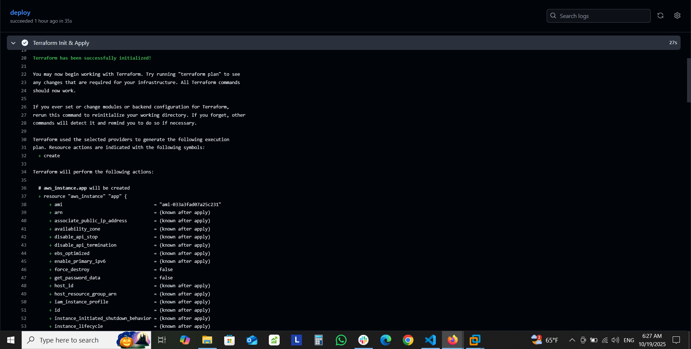
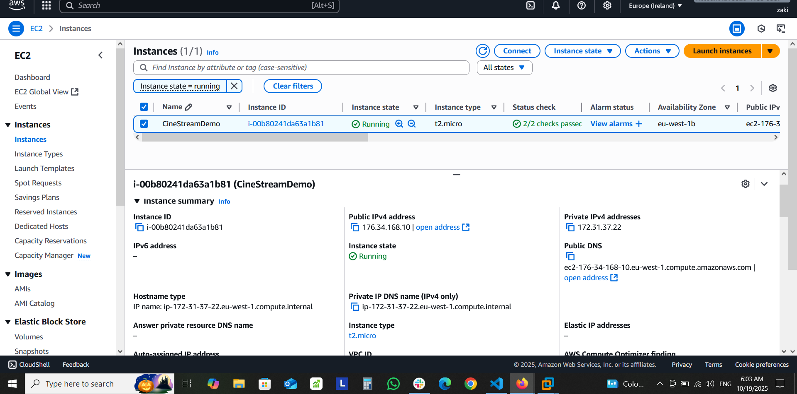
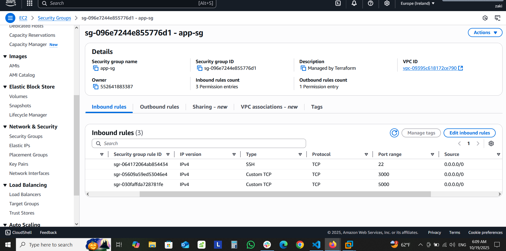
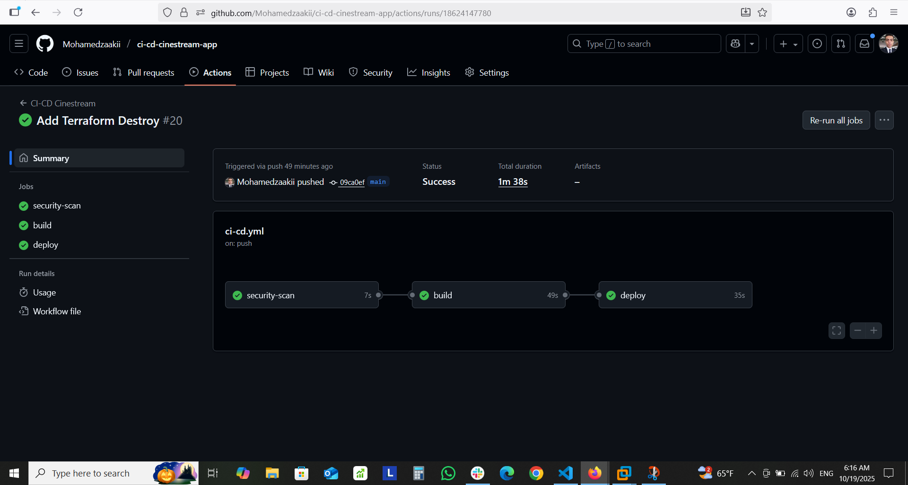
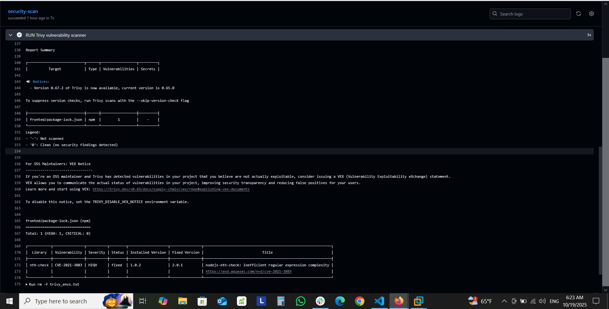
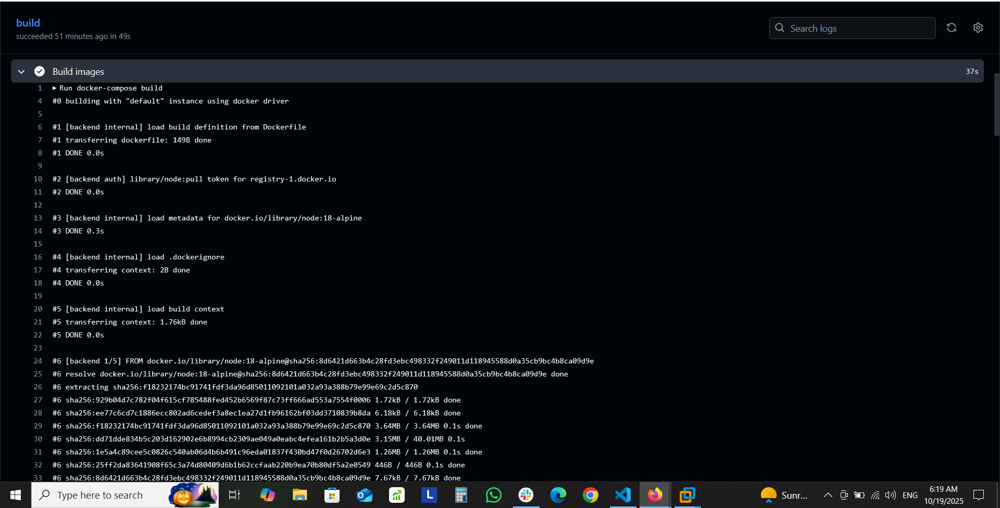
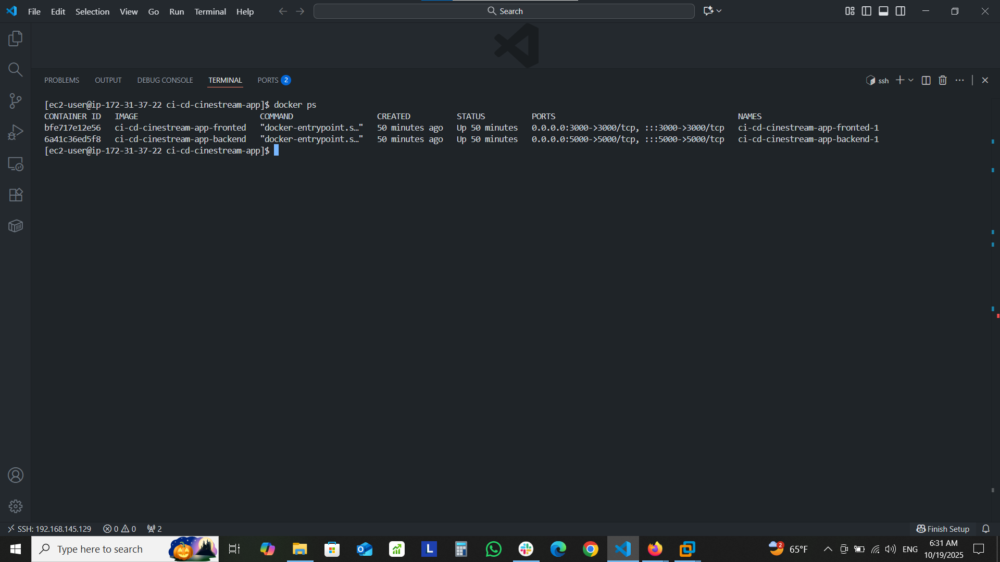
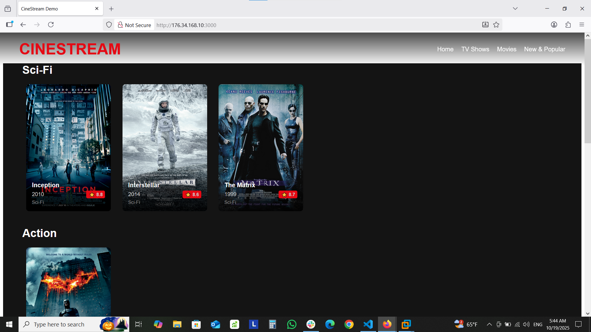
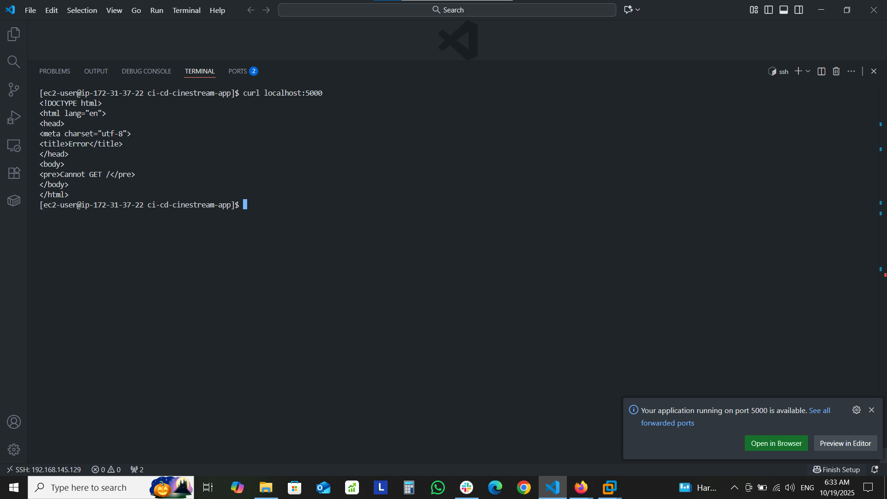
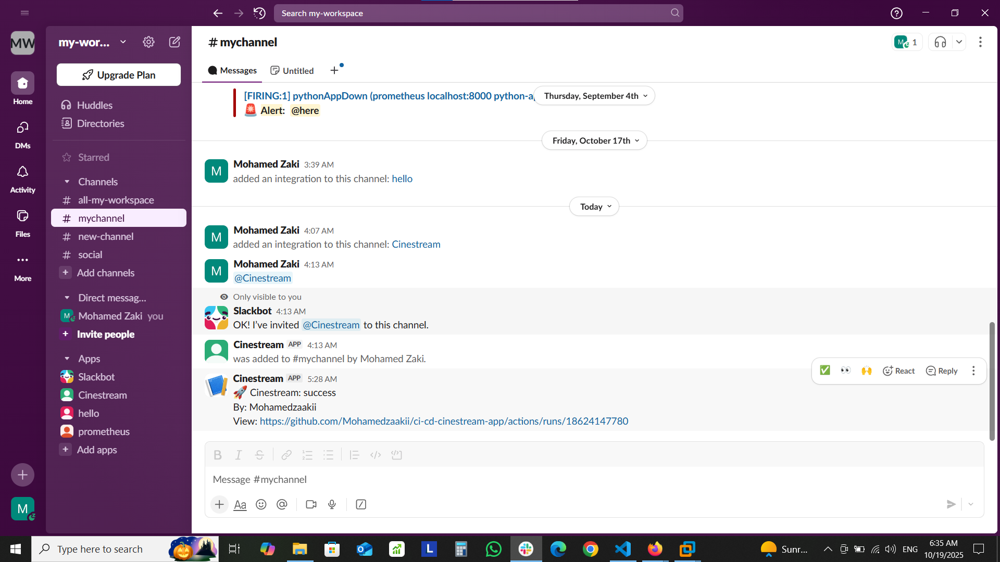

# 🎬 Cinestream - Complete CI/CD


## 🚀 Project Overview
A full-stack movie application with automated CI/CD pipeline deploying to AWS EC2 using Terraform, Docker, and GitHub Actions. Cinestream demonstrates a complete DevOps workflow with infrastructure as code, containerization, security scanning, and automated deployments.

## 🏗️ Architecture
### Infrastructure
- **AWS EC2** - Application hosting
- **Terraform** - Infrastructure as Code
- **Docker** - Containerization
- **Docker Compose** - Multi-container orchestration

### CI/CD Pipeline
- **GitHub Actions** - Automated workflows
- **Trivy** - Security vulnerability scanning
- **Terraform Validation** - Infrastructure testing
- **Slack Notifications** - Deployment alerts
  
## 📁 Project Structure
```text
ci-cd-cinestream-app/
├── .github/workflows/
│ ├── ci-cd.yml 
│ └── destroy.yml 
├── terraform/
│ ├── main.tf 
│ ├── variables.tf 
│ └── outputs.tf 
├── backend/
│ ├── Dockerfile
│ ├── server.js
│ └── package.json
├── fronted/
│ ├── Dockerfile
│ ├── package.json
│ ├── public/
│ │ └── index.html 
│ └── src/  
│   ├── App.js
│   ├── index.js
│   └── components/
│     └── MovieCard.js
├── docker-compose.yml
└── README.md
└── .gitignore
```
## 🔧 Technologies Used
- **Infrastructure**: Terraform, AWS EC2
- **CI/CD**: GitHub Actions, Docker
- **Frontend**: React.js, HTML, CSS
- **Backend**: Node.js, Express
- **Security**: Trivy vulnerability scanning
- **Monitoring**: Slack notifications

## 🛠️ Setup & Deployment

### Prerequisites
- AWS Account with IAM credentials
- GitHub Repository
- Slack Workspace (for notifications)

### Automated Deployment
1. Push code to main branch
2. GitHub Actions automatically:
   - Security scan with Trivy
   - Build Docker images
   - Validate Terraform configuration
   - Provision AWS infrastructure
   - Deploy application
   - Send Slack notification
  
### Manual Controls
- **Destroy Infrastructure**: Use the manual `Destroy Infrastructure` workflow in GitHub Actions
  
## 📸 Screenshots

### Infrastructure




### CI/CD Pipeline




### Application




### Notifications


## 🔄 Workflow Details
### Main CI/CD Pipeline (.github/workflows/ci-cd.yml)
```yaml
name: CI-CD Cinestream
on: [push]
jobs:
  security-scan:    # Trivy vulnerability scanning
  build:            # Docker build and testing
  deploy:           # Terraform infrastructure + app deployment
```
### Destroy Workflow (.github/workflows/destroy.yml)
```yaml
name: Destroy Infrastructure
on: workflow_dispatch  # Manual trigger only
```
## 🚨 Security Features

- Trivy Scanning: CVE vulnerability detection
- Terraform Validation: Infrastructure code validation
- AWS Security Groups: Minimal port exposure
- Secret Management: GitHub encrypted secrets

## 📈 Monitoring & Notifications

- Slack Integration: Real-time deployment status
- GitHub Actions: Detailed workflow logs

## 🔍 Key Features Demonstrated
- ✅ Infrastructure as Code with Terraform
- ✅ Containerization with Docker & Docker Compose
- ✅ Automated CI/CD with GitHub Actions
- ✅ Security Scanning integrated in pipeline
- ✅ Infrastructure Destruction workflow
- ✅ Real-time Notifications with Slack
- ✅ Zero-downtime deployment capable

## 🌐 Access the Application
After deployment, access your application at:
```bash
http://EC2_PUBLIC_IP:3000
```
